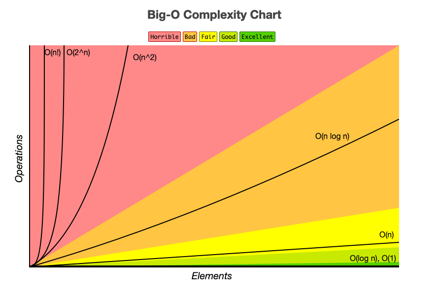

```{r setup, include=TRUE, echo=FALSE, results=FALSE, message=FALSE}
knitr::opts_chunk$set(echo = TRUE, fig.width = 8, fig.height = 6)
library(tidyverse)
library(scales)
library(patchwork)
```

## Today's Learning Goals {.smaller}

::: {.fragment}
By the end of this session, you'll understand:
:::

::: {.fragment}
- **Large n vs Large p**: Different challenges, different solutions
- **The curse of dimensionality**: Why more features ≠ better models
- **Computational complexity**: How data size affects algorithm choice
- **Statistical considerations**: Sampling, bias, and inference at scale
- **Policy implications**: When big data helps (and when it doesn't)
:::

::: {.fragment}
::: callout-important
**Key insight**: The size and structure of your data fundamentally determines what methods you can use and what conclusions you can draw.
:::
:::

# Part I: Defining the Data Landscape

## The Two Faces of "Large Data" {.smaller}

Data can be large in fundamentally different ways:

::: {layout-ncol=2}
### Large n (Many Observations)
- **Millions of rows**
- **Systems challenges**: Storage, I/O, distributed computing
- **Statistical benefits**: Law of large numbers, central limit theorem
- **Examples**: Transaction logs, sensor data, administrative records

### Large p (Many Features)  
- **Thousands of variables**
- **Statistical challenges**: Overfitting, multiple testing, sparsity
- **Computational benefits/costs**: Parallel processing across features
- **Examples**: Genomics, text analysis, survey data, satellite imagery
:::

::: {.fragment}
**Critical distinction**: These require completely different analytical approaches and have different implications for inference.
:::

## The n × p Matrix: A Framework {.smaller}

```{r}
#| echo: false
#| fig-width: 10
#| fig-height: 6

# Create a visualization of the n x p space
data_types <- tibble(
  n = c(100, 1000000, 100, 1000000, 10000, 50000),
  p = c(5, 5, 10000, 1000, 500, 2000),
  type = c("Small Data", "Big n", "Big p", "Big n, Big p", "Medium n, Medium p", "Medium n, Big p"),
  color = c("Small", "Large n", "Large p", "Both Large", "Medium", "Medium n, Large p")
)

ggplot(data_types, aes(x = log10(n), y = log10(p))) +
  geom_point(aes(color = color), size = 4, alpha = 0.8) +
  geom_text(aes(label = type), vjust = -0.5, size = 3) +
  scale_x_continuous(name = "log10(n) - Number of Observations", 
                     breaks = c(2, 3, 4, 5, 6), 
                     labels = c("100", "1K", "10K", "100K", "1M")) +
  scale_y_continuous(name = "log10(p) - Number of Features",
                     breaks = c(0, 1, 2, 3, 4),
                     labels = c("1", "10", "100", "1K", "10K")) +
  scale_color_viridis_d(name = "Data Type") +
  labs(title = "The Data Landscape: n × p Space",
       subtitle = "Different regions require different analytical approaches") +
  theme_minimal() +
  theme(legend.position = "right",
        text = element_text(size = 12))
```

## Classical Statistics: The Small n, Small p World {.smaller}

::: {.fragment}
**Traditional assumptions** (n = 100s, p = 10s):

- n >> p (much more data than parameters)
- Features are independent or nearly so
- Linear relationships dominate
- Normal distributions are common
- Significance testing is straightforward
:::

::: {.fragment}
**Methods that work well:**
- Linear/logistic regression
- t-tests, ANOVA
- Classical hypothesis testing
- Maximum likelihood estimation
:::

::: {.fragment}
**Policy context**: Randomized controlled trials, small-scale surveys, laboratory experiments
:::

## Large n: The Promise and Peril {.smaller}

::: {.fragment}
**Benefits of many observations:**

- **Statistical power**: Detect smaller effect sizes
- **Precision**: Narrower confidence intervals  
- **Robustness**: Central limit theorem kicks in
- **Rare events**: Can study low-probability outcomes
:::

::: {.fragment}
**New challenges:**

- **Computational**: Algorithms that scale O(n²) become infeasible
- **Storage**: Memory limitations, disk I/O bottlenecks
- **Statistical significance vs practical significance**: Everything becomes "significant"
- **Data quality**: More observations ≠ better quality
:::

::: {.fragment}
**Example**: 10 million credit card transactions
- Can detect fraud patterns invisible in small samples
- But requires distributed computing and careful quality control
:::

## Large p: The Curse of Dimensionality {.smaller}

::: {.fragment}
**What happens when p approaches n?**

- **Overfitting**: Models memorize noise instead of learning patterns
- **Multiple testing**: False discovery rate explodes
- **Sparsity**: Most features are irrelevant
- **Distance metrics break down**: All points become equidistant
:::

::: {.fragment}
**Mathematical reality**: With p = 1000 features and n = 100 observations:

- Perfect fit is always possible (infinite solutions)
- Out-of-sample performance typically terrible
- Traditional inference breaks down
:::

::: {.fragment}
**Policy example**: Survey with 500 questions, 200 respondents
- Can "predict" any outcome perfectly in-sample
- Predictions on new data will be random
- Need regularization, feature selection, or more data
:::

# Part II: Statistical Challenges at Scale

## The Multiple Testing Problem {.smaller}

::: {.fragment}
**The setup**: Testing 1000 features for association with an outcome
:::

```{r}
# Simulate the multiple testing problem
set.seed(123)
n_tests <- 1000
n_obs <- 100

# Generate completely random data (no true associations)
p_values <- replicate(n_tests, {
  x <- rnorm(n_obs)  # Random predictor
  y <- rnorm(n_obs)  # Random outcome
  t.test(y ~ (x > median(x)))$p.value
})

# Count "significant" results
significant_05 <- sum(p_values < 0.05)
significant_01 <- sum(p_values < 0.01)

cat("Out of", n_tests, "completely random tests:\n")
cat("- Significant at p < 0.05:", significant_05, "(expected ~50)\n")
cat("- Significant at p < 0.01:", significant_01, "(expected ~10)\n")
```

::: {.fragment}
**The problem**: With no true effects, we still find ~50 "significant" results at α = 0.05!
:::


## The Bias-Variance Tradeoff in High Dimensions {.smaller}

::: {.fragment}
**Classical tradeoff**: 

- **Bias**: How far off is our average prediction?
- **Variance**: How much do predictions vary across samples?
- **Goal**: Minimize total error = Bias² + Variance + Irreducible Error
:::

::: {.fragment}
**In high dimensions** (large p):

- **Low bias, high variance**: Complex models fit training data perfectly but generalize poorly
- **High bias, low variance**: Simple models underfit but are consistent
- **Sweet spot**: Regularization finds the optimal tradeoff
:::

::: {.fragment}
**Policy implication**: A simple model that works consistently across contexts may be better than a complex model that's perfect in one setting but fails elsewhere.
:::

## Regularization: Taming High-Dimensional Data {.smaller}

::: {.fragment}
**The problem**: Ordinary least squares with p ≈ n gives unstable estimates
:::

::: {.fragment}
**Ridge Regression** (L2 penalty):

- Shrinks coefficients toward zero
- Keeps all features but reduces their impact
- Good when many features are somewhat relevant
:::

::: {.fragment}
**Lasso Regression** (L1 penalty):

- Forces some coefficients to exactly zero
- Automatic feature selection
- Good when most features are irrelevant
:::

::: {.fragment}
**Elastic Net** combines L1 and L2 penalties, balances feature selection with stability, often the practical choice.

:::

# Part III: Computational Considerations

## Algorithmic Complexity: Why Size Matters {.smaller}

::: {.fragment}
**Big O notation** describes how runtime scales with data size:
:::

::: {layout-ncol=2}
### Common Complexities
- **O(1)**: Constant time
- **O(log n)**: Logarithmic  
- **O(n)**: Linear
- **O(n log n)**: Log-linear
- **O(n²)**: Quadratic
- **O(n³)**: Cubic
- **O(2ⁿ)**: Exponential

### Real-World Impact
- **Linear regression**: O(np²) 
- **k-means clustering**: O(nkt) iterations
- **Random forest**: O(n log n × p × trees)
- **Deep learning**: O(depends...)
:::

::: {.fragment}
**Example**: Matrix inversion is O(p³). With p = 10,000 features, that's 10¹² operations!
:::

## Big 0 Visualized {.smaller}



## Memory vs Computation Tradeoffs {.smaller}

```{r}
# Demonstrate memory scaling
data_sizes <- tibble(
  n = c(1000, 10000, 100000, 1000000),
  p = c(10, 100, 1000, 10000),
  memory_gb = (n * p * 8) / (1024^3),  # 8 bytes per double
  matrix_ops = (p^3) / 1e9  # Billions of operations for matrix inversion
)

knitr::kable(data_sizes, 
             col.names = c("Observations", "Features", "Memory (GB)", "Matrix Ops (Billions)"),
             digits = c(0, 0, 3, 1),
             caption = "Memory and Computational Requirements")
```

::: {.fragment}
**Key insight**: Memory scales linearly (n×p), but many algorithms scale polynomially or worse in p.
:::

## Distributed Computing: When One Machine Isn't Enough {.smaller}

::: {.fragment}
**MapReduce paradigm**:

1. **Map**: Apply function to chunks of data in parallel
2. **Reduce**: Combine results from all chunks
3. **Repeat**: Until convergence or completion
:::

::: {.fragment}
**What works well**:

- Simple aggregations (sums, means, counts)
- Embarrassingly parallel problems
- Algorithms that can be decomposed into independent steps
:::

::: {.fragment}
**What doesn't**:

- Algorithms requiring global information, iterative methods with dependencies, complex joins or sorts
:::

# Part IV: The Quality vs Quantity Debate

## Case Study: The Literary Digest Disaster (1936) {.smaller}

::: {.fragment}
**The setup**:

- Literary Digest magazine conducts presidential poll
- Sends 10+ million survey cards
- Receives 2.4 million responses (24% response rate)
- **Massive sample size** for 1936!
:::

::: {.fragment}
**The prediction**: Alf Landon defeats Franklin Roosevelt 57% to 43%
:::

::: {.fragment}
**The reality**: Roosevelt wins 61% to 37% - one of the biggest landslides in US history
:::

::: {.fragment}
**What went wrong?**

- **Sample frame bias**: Telephone directories and car registrations (wealthy people)
- **Non-response bias**: Republicans more likely to respond
- **Big ≠ representative**: 2.4 million biased responses < 50,000 random responses
:::

## Modern Parallels: When Big Data Fails {.smaller}

::: {.fragment}
**Google Flu Trends (2009-2015)**:

- Used search queries to predict flu outbreaks
- Initially very successful
- Gradually became less accurate as search behavior changed
- **Lesson**: Behavioral data can be non-stationary
:::

::: {.fragment}
**2016 Election Polling**:

- Massive online samples
- Still missed key demographic shifts
- **Lesson**: Coverage bias persists even with large samples
:::


## The Data Generating Process: A Framework for Thinking {.smaller}

::: {.fragment}
**Key questions for any large dataset**:

1. **Who/what is included?** (Coverage)
2. **Who/what is missing?** (Selection bias)
3. **How was it collected?** (Measurement process)
4. **Why was it collected?** (Original purpose vs your purpose)
5. **When was it collected?** (Temporal stability)
6. **How does it relate to your target population?** (External validity)
:::

::: {.fragment}
**Policy example**: Using cell phone location data to study mobility. **Included**: Smartphone users with location services enabled. **Missing**: Elderly, low-income, privacy-conscious individuals. **Bias**: Overrepresents young, urban, tech-savvy population
:::

# Part V: Statistical Learning in High Dimensions

## The Fundamental Tradeoff: Flexibility vs Interpretability

```{r}
#| echo: false
#| fig-width: 10
#| fig-height: 6

# Create interpretability vs flexibility plot
methods <- tibble(
  method = c("Linear Regression", "Logistic Regression", "Ridge/Lasso", 
            "Decision Trees", "Random Forest", "Gradient Boosting", "SVM", "Neural Networks", "Deep Learning"),
  interpretability = c(9, 8, 6, 7, 3, 2, 2, 2, 1),
  flexibility = c(3, 4, 5, 6, 8, 9, 7, 8, 9),
  best_for = c("Small p", "Small p", "Large p", "Medium p", "Large p", "Large p", "Medium p", "Large p", "Very Large p")
)

ggplot(methods, aes(x = flexibility, y = interpretability)) +
  geom_point(aes(color = best_for), size = 4, alpha = 0.7) +
  geom_text(aes(label = method), vjust = -0.5, size = 3) +
  scale_x_continuous(name = "Flexibility (Model Complexity)", limits = c(0, 10)) +
  scale_y_continuous(name = "Interpretability", limits = c(0, 10)) +
  scale_color_viridis_d(name = "Best For") +
  labs(title = "The Interpretability-Flexibility Tradeoff",
       subtitle = "Policy contexts often require interpretable models") +
  theme_minimal() +
  theme(legend.position = "right")
```

## Model Validation: Beyond Training Accuracy {.smaller}

::: {.fragment}
**Why traditional methods fail in high dimensions**:

- Training error always decreases with model complexity
- R² can always reach 1.0 with enough parameters
- Statistical significance becomes meaningless
:::

::: {.fragment}
**The fundamental principle**: Always test on data the model hasn't seen during training
:::

::: {.fragment}
**The stakes**: Wrong validation = wrong model selection = failed deployment
:::

## Validation Strategy Selection {.smaller}

::: {.fragment}
**Key question**: How will your model be used in practice?
:::

::: {layout-ncol=2}
### Data Structure Considerations
- **Independent observations?** → Random splits
- **Time series?** → Temporal splits  
- **Clustered data?** → Group-aware splits
- **Spatial data?** → Geographic splits
- **Imbalanced classes?** → Stratified splits

### Computational Constraints
- **Large n, small compute?** → Simple hold-out
- **Small n, need precision?** → k-fold CV
- **Time series, need speed?** → Rolling window
- **Very large p?** → Nested CV with feature selection
:::

## Common Validation Strategies {.smaller}

::: {.fragment}
**Hold-out (70/15/15)**:

- **Best for**: Large datasets, limited compute time
- **Pros**: Fast, simple, mirrors real deployment
- **Cons**: Wastes data, high variance with small samples
:::

::: {.fragment}
**k-Fold Cross-Validation**:

- **Best for**: Medium datasets, i.i.d. assumptions hold
- **Pros**: Uses all data, stable estimates
- **Cons**: k×training time, assumes exchangeable observations
:::

::: {.fragment}
**Time Series Validation**:

- **Best for**: Temporal data, forecasting problems
- **Pros**: Respects time order, prevents data leakage
- **Cons**: Limited training data, requires careful design
:::

## Advanced Validation Considerations {.smaller}

::: {.fragment}
**Nested Cross-Validation**:

- **When**: Hyperparameter tuning + model selection
- **Why**: Prevents overfitting to validation set
- **Cost**: k×m×training time (expensive!)
:::

::: {.fragment}
**Group-Based Splits**:

- **Examples**: Patients in hospitals, students in schools, counties in states
- **Critical**: Prevents information leakage between related observations
- **Policy relevance**: Most policy data has hierarchical structure
:::

::: {.fragment}
**Computational Trade-offs**:

- **Large n**: Simple splits often sufficient
- **Large p**: Feature selection within CV folds
- **Both large**: Distributed computing, approximate methods
:::

## Validation Pitfalls in Policy Research {.smaller}

::: {.fragment}
**Data leakage examples**:

- Using future information to predict past events
- Including outcome-derived features
- Ignoring temporal dependencies in panel data
- Not accounting for policy implementation timing
:::

::: {.fragment}
**Domain mismatch**:

- Training on one population, deploying on another
- Different time periods (policy environment changes)
- Different geographic regions (local context matters)
- Different institutional settings
:::

::: {.fragment}
**Critical insight**: **Your validation strategy is a statement about how you believe your model will generalize.** Choose carefully.
:::

## Feature Selection: Finding Signal in the Noise {.smaller}

::: {.fragment}
**The challenge**: With p = 10,000 features, most are irrelevant noise
:::

::: {.fragment}
**Filter methods**: Rank features by correlation with outcome.Fast but ignores feature interactions. Good for initial screening.
:::

::: {.fragment}
**Wrapper methods**: Forward/backward selection based on model performance. Computationally expensive but considers interactions. Risk of overfitting with many features.
:::

::: {.fragment}
**Embedded methods**: Feature selection built into the algorithm (Lasso, Random Forest). Balance between speed and accuracy. Often the practical choice.

:::

# Part VI: Policy Applications and Case Studies

## Case Study 1: Predicting Policy Outcomes {.smaller}

::: {.fragment}
**Scenario**: City wants to predict which neighborhoods will benefit most from job training programs
:::

::: {.fragment}
**Large n approach** (Administrative data):
- **Data**: 100,000 residents, 20 features
- **Method**: Logistic regression, random forest
- **Strength**: Reliable estimates for major demographic groups
- **Weakness**: May miss important but rare subgroups
:::

::: {.fragment}
**Large p approach** (Survey + external data):
- **Data**: 1,000 residents, 500 features (survey + census + business data)
- **Method**: Lasso regression, elastic net
- **Strength**: Can identify complex interaction patterns
- **Weakness**: Estimates may not generalize to broader population
:::

::: {.fragment}
**Policy insight**: Large n better for implementation; large p better for discovery of new mechanisms
:::

## Case Study 2: Fraud Detection at Scale {.smaller}

::: {.fragment}
**The problem**: Detect fraudulent transactions in real-time
- **Data**: Millions of transactions daily, hundreds of features
- **Constraints**: Must decide in milliseconds
- **Cost of errors**: False positives annoy customers, false negatives lose money
:::

::: {.fragment}
**Technical solution**:
- **Feature engineering**: Create derived features (spending patterns, location anomalies)
- **Ensemble methods**: Combine multiple simple models
- **Online learning**: Update models as new data arrives
- **A/B testing**: Continuously evaluate model performance
:::

::: {.fragment}
**Policy parallel**: Similar challenges in welfare fraud detection, tax compliance, regulatory monitoring
:::

## The Reproducibility Crisis in Large-Scale Studies {.smaller}

::: {.fragment}
**The problem**: Many "significant" findings from large datasets don't replicate
:::

::: {.fragment}
**Contributing factors**:
- **Multiple testing**: Fishing for significant results
- **P-hacking**: Trying different specifications until something is significant
- **Publication bias**: Only positive results get published
- **Data snooping**: Using the same data for exploration and confirmation
:::

::: {.fragment}
**Solutions**:
- **Pre-registration**: Specify hypotheses and analysis plan before seeing data
- **Hold-out samples**: Reserve data for final validation
- **Replication studies**: Test findings on independent datasets
- **Robust standard errors**: Account for multiple testing and clustering
:::

::: {.fragment}
**Policy implication**: Be skeptical of any single study, even with large samples. Look for replication and robustness.
:::

# Part VII: Practical Guidelines

## Decision Framework: Choosing Your Approach {.smaller}

::: {layout-ncol=2}
### When n >> p (Large n, Small p)
**Use:**
- Classical statistical methods
- Focus on causal inference
- Emphasize external validity
- Simple, interpretable models

**Examples:**
- A/B tests with millions of users
- Administrative data analysis
- Policy evaluation studies

### When p >> n (Small n, Large p)  
**Use:**
- Regularization methods
- Cross-validation for model selection
- Feature selection techniques
- Be very cautious about generalization

**Examples:**
- Genomics studies
- Text analysis with small samples
- Survey data with many questions
:::

::: {.fragment}
**When both n and p are large**: Use distributed computing, ensemble methods, and very careful validation procedures.
:::

## Best Practices for Large-Scale Analysis {.smaller}

::: {.fragment}
**Data quality**:
- Understand the data generating process
- Check for systematic biases and missing data patterns
- Validate against external benchmarks when possible
:::

::: {.fragment}
**Model development**:
- Always use proper train/validation/test splits
- Cross-validate hyperparameter selection
- Test robustness across different subgroups
:::

::: {.fragment}
**Interpretation**:
- Focus on effect sizes, not just statistical significance
- Consider practical significance for policy decisions
- Acknowledge limitations and uncertainty
:::

::: {.fragment}
**Communication**:
- Explain methods clearly to non-technical audiences
- Visualize uncertainty and confidence intervals
- Discuss what the analysis can and cannot tell us
:::

## Common Pitfalls and How to Avoid Them {.smaller}

::: {.fragment}
**"Big data solves everything"**

- **Reality**: Bias and poor measurement still matter
- **Solution**: Focus on data quality, not just quantity
:::

::: {.fragment}
**"More features = better predictions"**

- **Reality**: Curse of dimensionality, overfitting
- **Solution**: Use regularization and feature selection
:::

::: {.fragment}
**"Statistical significance = practical importance"**

- **Reality**: Large samples make everything "significant"
- **Solution**: Focus on effect sizes and confidence intervals
:::

::: {.fragment}
**"Correlation patterns reveal causation"**

- **Reality**: Confounding and selection bias persist at scale
- **Solution**: Use causal inference methods, natural experiments
:::

## Looking Forward: Emerging Challenges

::: {.fragment}
**Algorithmic fairness**: How do we ensure large-scale models don't perpetuate bias?
:::

::: {.fragment}
**Privacy and ethics**: How do we balance analytical power with individual privacy?
:::

::: {.fragment}
**Interpretability**: How do we make complex models understandable to policymakers?
:::

::: {.fragment}
**Temporal stability**: How do we handle models that become obsolete as the world changes?
:::

::: {.fragment}
**Democratic accountability**: How do we govern algorithmic decision-making in public policy?
:::

## Next Steps {.smaller}

::: {.fragment}
**For Wednesday's Lab 3:**

- **Loading and Storing Data Efficiently** - hands-on practice with large datasets
- Learn about data storage formats (Parquet, Arrow) for big data
- Practice efficient data workflows and reproducible analysis
:::

::: {.fragment}
**Before Wednesday, please read/watch:**

- **MDSR Ch. 1**: Why Data Science?
- **MDSR Ch. 21**: Towards "Big Data"  
- **LAT Methodology**: Labor Action Tracker methodology
- **MDSR Appendix D**: Reproducible Analysis and Workflow
- **Video**: Store Your R Data in Apache Parquet Big Data Format
:::

## Questions?

::: {.fragment}
**Remember**: The size and structure of your data should drive your analytical approach.
:::
