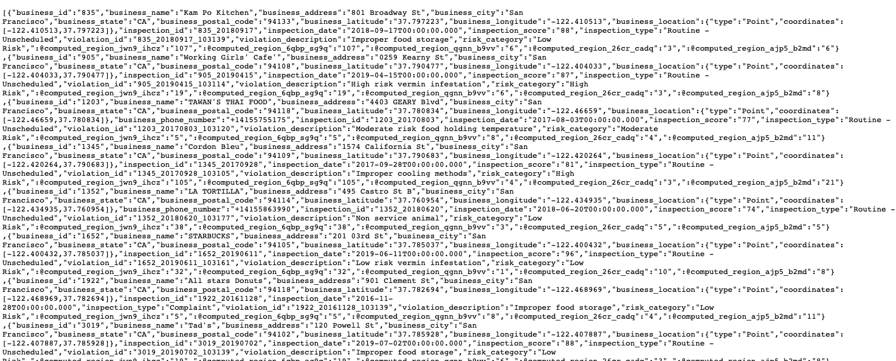

```{r setup, include=TRUE, echo=FALSE, results=FALSE, message=FALSE}
knitr::opts_chunk$set(echo = TRUE, fig.width = 8, fig.height = 6)
library(tidyverse)
library(httr)
library(jsonlite)
library(scales)
library(patchwork)
```

## Today's Learning Goals {.smaller}

::: {.fragment}
By the end of this session, you'll be able to:
:::

::: {.fragment}
- **Identify** different types of web data sources and their structures
- **Navigate** common data formats (JSON, XML, CSV)
- **Apply** appropriate tools for different data collection scenarios
- **Evaluate** trade-offs between different data collection methods
:::

::: {.fragment}
::: callout-note
**Key insight**: The method you choose to collect data affects both the quality of your analysis and the reproducibility of your work.
:::
:::

# Part I: The Data Collection Landscape

## The Data Quality Hierarchy {.smaller}

::: {.fragment}
**From worst to best practices:**
:::

::: {layout-ncol=2}
### Manual Methods
- Copy-paste (Never do this!)
- Manual downloads
- Screenshot parsing
- PDF extraction

### Automated Methods
- API calls (Best!)
- Web scraping (When needed)
- Automated downloads
- Database connections
:::

::: {.fragment}
::: callout-important
**Remember**: Your analysis is only as reproducible as your data collection process.
:::
:::

## Tidy Data: The Gold Standard {.smaller}

::: {.fragment}
**The three rules of tidy data:**

1. Every column is a variable
2. Every row is an observation
3. Every cell is a single value
:::

## The Raw Reality: JSON APIs {.smaller}

Most APIs return data in JSON format. Let's look at a typical response:

```{r eval=TRUE}
# Example weather API response
weather_json <- '{
  "location": {
    "name": "San Diego",
    "region": "California",
    "country": "USA"
  },
  "current": {
    "temp_f": 72,
    "condition": {
      "text": "Sunny",
      "humidity": 65
    }
  },
  "forecast": {
    "daily": [
      {"date": "2025-10-20", "high": 75, "low": 62},
      {"date": "2025-10-21", "high": 73, "low": 61}
    ]
  }
}'
```

::: {.fragment}
::: callout-note
JSON is hierarchical - objects contain other objects, arrays, or simple values.
:::
:::

## Basic JSON Parsing with jsonlite {.smaller}


```{r eval=TRUE}
library(httr)
library(jsonlite)

# Parse JSON into R objects
weather_data <- fromJSON(weather_json)

# Access nested data easily
cat("Location:", weather_data$location$name, "\n")
cat("Current temp:", weather_data$current$temp_f, "°F\n")

# Arrays automatically become data frames
cat("\nNext two days forecast:\n")
forecast <- as_tibble(weather_data$forecast$daily)
print(forecast)
```

::: {.fragment}
::: callout-note
jsonlite handles common JSON patterns well, but real APIs often have more complex structures.
:::
:::

## From JSON to Domain-Specific Packages {.smaller}

While jsonlite is great for basic JSON, specialized packages like tidycensus make working with specific APIs even easier:

```{r eval=FALSE}
library(tidycensus)
library(tidyverse)

# Just specify the variables you want
vars <- c(
  "median_income" = "B19013_001",  # No need to know JSON structure
  "population" = "B01003_001"      # Just use meaningful names
)

# One function handles the API call, JSON parsing, and data cleaning
state_data <- get_acs(
  geography = "state",
  variables = vars,
  year = 2021,
  survey = "acs5"
)
```

::: {.fragment}
::: callout-tip
Domain-specific packages like tidycensus abstract away the technical details so you can focus on the data you need!
:::
:::

## The Result: Clean, Tidy Data {.smaller}

Now let's look at our tidy dataset:

```{r echo=FALSE}
# Load required packages
library(tidyverse)

# Create example data (since we can't make actual API calls in slides)
state_summary <- tibble(
  NAME = c("California", "Texas", "Florida", "New York", "Illinois"),
  median_income = c(78672, 64034, 57703, 71117, 65886),
  population = c(39538223, 29145505, 21538187, 19836286, 12671821)
) %>%
  arrange(desc(population))

# Display nicely formatted results
state_summary %>%
  mutate(
    population = scales::comma(population),
    median_income = scales::dollar(median_income)
  ) %>%
  knitr::kable(
    col.names = c(
      "State",
      "Median Household Income",
      "Total Population"
    ),
    align = c('l', 'r', 'r')
  )
```

::: {.fragment}
::: callout-note
Each row is a month, each column is a different economic measure, and each cell is a single value - perfectly tidy!
:::
:::

## What We Want vs. What We Get {.smaller}

::: {layout-ncol=2}
### What We Want
- Clean, structured data
- Ready for analysis
- Well-documented
- Easy to update

### What We Often Get
{width=80%}
:::

::: {.fragment}
**Common challenges:**

- Unstructured formats
- Missing documentation
- Rate limits
- Changing APIs
:::

# Part II: Understanding Web Data Formats

## The Three Main Data Languages {.smaller}

::: {.fragment}
**1. JSON (JavaScript Object Notation)**
```json
{
  "name": {
    "first": "Rod",
    "last": "Albuyeh"
  },
  "employed": true,
  "profession": "Lecturer, UC San Diego",
  "emails": ["ralbuyeh@ucsd.edu", "ralbuyeh@sandiego.edu"]
}
```
:::

::: {.fragment}
**2. XML (eXtensible Markup Language)**
```xml
<name>
  <first>Rod</first>
  <last>Albuyeh</last>
</name>
<employed>true</employed>
<profession>Lecturer, UC San Diego</profession>
<contact-info>
    <email-addresses>
      <email>ralbuyeh@ucsd.edu</email>
      <email>ralbuyeh@sandiego.edu</email>
    </email-addresses>
  </contact-info>
```
:::

## YAML: A More Human-Readable Format {.smaller}

::: {.fragment}
YAML is designed to be easy for humans to read and write:

```yaml
name:
  first: Rod
  last: Albuyeh
employed: true
profession: Lecturer, UC San Diego
emails:
  - ralbuyeh@ucsd.edu
  - ralbuyeh@sandiego.edu
```
:::

::: {.fragment}
::: callout-note
Notice how YAML uses indentation and simple punctuation instead of braces or tags.
:::
:::

## Working with APIs: Setup {.smaller}

First, let's set up our request to the Bureau of Labor Statistics API:

```{r}
#| echo: true
library(httr)
library(jsonlite)

# Define which states we want unemployment data for
# Series IDs are structured as: LAUST[state_fips]00000000003
# where '03' at the end indicates unemployment rate
# For example: LAUST060000000000003 is California's unemployment rate
state_series <- list(
  "LAUST060000000000003",  # California unemployment rate
  "LAUST360000000000003",  # New York unemployment rate
  "LAUST480000000000003",  # Texas unemployment rate
  "LAUST120000000000003",  # Florida unemployment rate
  "LAUST170000000000003"   # Illinois unemployment rate
)

# Create the API request body
state_request <- list(
  seriesid = state_series,
  startyear = "2023",
  endyear = "2023"
)
```

::: {.fragment}
::: callout-note
The BLS API uses series IDs to identify specific economic indicators by state.
:::
:::

## Working with APIs: Making the Request {.smaller}

Now we'll send our request and look at the JSON structure:

```{r}
#| echo: true
# Show what we're sending
cat("API Request Structure:\n")
cat(toJSON(state_request, pretty = TRUE))

# Make the API call
state_response <- POST(
  "https://api.bls.gov/publicAPI/v2/timeseries/data/",
  body = toJSON(state_request),
  encode = "json",
  content_type_json()
)

```

## Looking at the API Response {.smaller}

Here's what we get back from the BLS API:

```{r}
#| echo: false
#| eval: true
example_response <- list(
  status = "REQUEST_SUCCEEDED",
  responseTime = 150,
  message = list(),
  Results = list(
    series = list(
      list(
        seriesID = "LAUST060000000000003",
        data = list(
          list(
            year = "2023",
            period = "M09",
            periodName = "September",
            value = "4.1",
            footnotes = list(list(code = "P", text = "Preliminary."))
          ),
          list(
            year = "2023",
            period = "M08",
            periodName = "August",
            value = "4.2",
            footnotes = list()
          ),
          list(
            year = "2023",
            period = "M07",
            periodName = "July",
            value = "4.0",
            footnotes = list()
          )
        ),
        state = "CA",
        measure = "Unemployment Rate"
      )
    )
  )
)

cat("API Response:\n")
cat(toJSON(example_response, pretty = TRUE))
```

## Working with APIs: Data Cleaning {.smaller}

Now let's see how to extract the data we want:

```{r}
#| echo: true
#| eval: true
# Extract data points from the nested structure
clean_data <- map_df(example_response$Results$series[[1]]$data, function(point) {
  tibble(
    date = as.Date(paste(point$year, substr(point$period, 2, 3), "01", sep="-")),
    state = example_response$Results$series[[1]]$state,
    rate = as.numeric(point$value),
    is_preliminary = any(sapply(point$footnotes, function(f) f$code == "P"))
  )
}) %>%
  arrange(desc(date))

# Show the clean result
clean_data
```

::: {.fragment}
::: callout-tip
Notice how we've gone from nested JSON to a clean, rectangular data frame!
:::
:::

::: {.fragment}
::: callout-tip
**Pro tip**: Always check API documentation for rate limits and terms of service!
:::
:::

# Part III: Data Collection Methods

## Method 1: APIs (Application Programming Interfaces) {.smaller}

::: {.fragment}
**Benefits:**

- Structured data
- Official support
- Rate limiting
- Documentation
:::

::: {.fragment}
**Popular R packages for APIs:**

- `WDI` (World Bank)
- `tidycensus` (US Census)
- `rtweet` (Twitter)
- `gtrendsR` (Google Trends)
:::

:::

## Example: World Bank Development API {.smaller}

The World Bank provides a rich API for accessing global economic data:

```{r}
#| echo: true
#| eval: false
library(WDI)

# First, let's see what indicators are available
# WDIsearch('gdp') would show all GDP-related indicators

# Get GDP per capita (constant 2015 US$) for G7 countries
gdp_data <- WDI(
  country = c("USA", "GBR", "JPN", "DEU", "FRA", "ITA", "CAN"),  # ISO3 codes
  indicator = c(
    "gdp_pc" = "NY.GDP.PCAP.KD",     # GDP per capita
    "gdp_growth" = "NY.GDP.MKTP.KD.ZG"  # GDP growth rate
  ),
  start = 2015,
  end = 2023,
  extra = TRUE,  # Get country metadata
  language = "en"  # Ensure English labels
)
```

::: {.fragment}
::: callout-tip
The WDI package handles all the API complexity, including authentication and rate limiting!
:::
:::

## Method 2: Web Scraping {.smaller}

::: {.fragment}
**When to use:**

- No API available
- Simple HTML structure
- Public data
- Infrequent updates
:::

::: {.fragment}
**Key considerations:**

- Check robots.txt
- Rate limiting
- Site structure changes
- Legal implications
:::

::: 

## Example: Scraping Wikipedia Tables {.smaller}

The `rvest` package makes it easy to scrape structured data:

```{r}
#| echo: true
#| eval: false
library(rvest)

# Example: Scraping a table
url <- "https://en.wikipedia.org/wiki/List_of_largest_companies_by_revenue"
page <- read_html(url)
table <- page %>%
  html_nodes("table") %>%  # Find all tables
  .[[1]] %>%              # Take first table
  html_table()            # Convert to data frame
```

::: {.fragment}
::: callout-tip
Wikipedia is a good place to practice web scraping - they allow it and their HTML is well-structured!
:::
:::

## Method 3: Automated Downloads {.smaller}

::: {.fragment}
**Best for:**

- Regular data releases
- ZIP/CSV files
- Bulk downloads
- Official sources
:::


## Example: Downloading Census Data Files {.smaller}

A real-world example of downloading and combining quarterly data:

```{r}
#| echo: true
#| eval: false
# Function to download a single quarter
download_census_file <- function(year, quarter) {
  # Construct URL and filename
  url <- sprintf(
    "https://www2.census.gov/programs-surveys/qwi/data/2023/qwi_%s_sa_%sq.csv.gz",
    year, quarter
  )
  dest <- sprintf("data/qwi_%s_%sq.csv.gz", year, quarter)
  
  # Create directory if needed
  dir.create("data", showWarnings = FALSE)
  
  # Try download with error handling
  tryCatch({
    download.file(url, dest, mode = "wb")  # binary mode for .gz
    message(sprintf("Downloaded %s", basename(dest)))
  }, error = function(e) {
    warning(sprintf("Failed to download %s: %s", basename(dest), e$message))
    return(NULL)
  })
  
  # Return path if successful
  if (file.exists(dest)) return(dest)
}

# Download all quarters for 2023
files <- map_chr(
  1:4,  # quarters
  ~download_census_file("2023", .x)
) 

# Read and combine (only if downloads succeeded)
data <- files %>%
  discard(is.null) %>%  # remove failed downloads
  map_dfr(read_csv, col_types = cols(.default = "c"))
```


## Best Practices for Downloads {.smaller}

When downloading data files, always remember to:

::: {.fragment}
- Use proper file modes (binary for compressed files)
- Create directories if they don't exist
- Handle download errors gracefully
- Verify files after download
- Clean up temporary files
- Document or log the data source and date
:::

::: {.fragment}
::: callout-important
Never assume downloads will succeed - always check and handle failures!
:::
:::


# Part IV: Best Practices and Common Pitfalls

## The Data Collection Workflow {.smaller}

::: {.fragment}
**1. Planning**

- Identify data needs
- Check available sources
- Review documentation
- Consider ethics/legality
:::

::: {.fragment}
**2. Implementation**

- Write reproducible code
- Include error handling
- Document assumptions
- Test thoroughly
:::

::: {.fragment}
**3. Maintenance**
- Monitor for changes, update dependencies, handle API updates, archive raw data
:::

## Common Pitfalls to Avoid {.smaller}

::: {layout-ncol=2}
### Technical Pitfalls
- Not handling errors
- Ignoring rate limits
- Missing authentication
- Poor error logging

### Process Pitfalls
- Manual steps
- Undocumented sources
- No version control
- Lost raw data
:::

::: {.fragment}
::: callout-important
**Remember**: Data collection is part of your analysis. Make it reproducible!
:::
:::

## Handling API Failures Gracefully {.smaller}

::: {.fragment}
**The challenge**: What happens when some API calls fail but we want to keep going?
:::

::: {.fragment}
**Solution**: Use `purrr::possibly()` to handle failures:
```{r}
#| echo: true
#| eval: true
# Example of error handling with purrr::possibly()
library(purrr)

# A function that might fail
get_stock_price <- function(symbol) {
  if(symbol == "ERROR") stop("API failed")  # simulate failure
  list(price = runif(1, 10, 100))  # simulate success
}

# Make a safe version that returns NA on failure
safe_get_price <- possibly(
  .f = get_stock_price,    # function to make safe
  otherwise = list(price = NA),  # what to return on error
  quiet = FALSE  # show the error message
)

# Try with multiple stocks - some will fail
stocks <- c("AAPL", "ERROR", "MSFT")
prices <- map(stocks, safe_get_price)  # keeps going even if some fail

# Show results
str(prices)
```
:::

## Error Handling with purrr {.smaller}

The `possibly()` function is a powerful way to handle errors when working with multiple API calls:

1. Takes a function that might fail
2. Returns a new function that won't fail
3. Instead of erroring, returns a default value
4. Great for batch operations where some might fail

::: {.fragment}
::: callout-tip
Use `possibly()` when you want to keep going even if some operations fail, like downloading multiple files or calling an API multiple times.
:::
:::

## Looking Forward: Emerging Tools and Trends {.smaller}

::: {.fragment}
**New developments in data collection:**

- **GraphQL APIs**: Query language that lets you request exactly what you need in one call, unlike REST APIs that have fixed responses
- **Real-time streaming**: Live data feeds (like Twitter's stream or financial data) instead of batch downloads
- **Data lakes**: Huge repositories that store raw data in its original format until needed, unlike databases that enforce structure upfront
- **Automated ETL**: Tools that automatically Extract, Transform, and Load data, reducing manual steps in data pipelines
:::

::: {.fragment}
**Future considerations:**

- Privacy regulations, API authentication, data governance, ethical collection
:::

## Next Steps {.smaller}


::: {.fragment}
**Before Wednesday's Lab 4 (Preprocessing and Transforming Data):**

- **Read**: MDSR 19.3 - Ingesting Text
- **Read**: Barria - Web Mining
- **Read**: Schutz - Mapping Local Government Priorities
- **Watch**: Web Scraping in R (YouTube)
- **Read**: MDSR 4 - Data Wrangling on One Table
- **Read**: The Quartz Guide to Bad Data
:::

## Questions?

::: {.fragment}
**Remember**: The quality of your data collection process directly impacts the reliability of your analysis.
:::
